# Cancer Research Workflow Showcase

  

这是一个仅包含项目说明和脱敏演示素材的公开展示仓库。生产代码、Prompt、API 配置、内部知识库与医生数据不在本仓库中。


| 项目维度 | 公开概览 |
|---|---|
| 项目定位 | 面向病理与临床医生的癌种诊断任务调研 Agent |
| 核心能力 | RAG 长期记忆、分阶段生成、多模型审核、医生闭环 |
| 交付形式 | 七字段任务表、审核建议、历史记录与 Excel 导出 |
| 公开范围 | 脱敏流程、代表模块、演示动图和内部基准摘要 |

## 目录

- [项目简介](#项目简介)
- [RAG：作为 Agent 的长期记忆](#rag作为-agent-的长期记忆)
- [Agent Harness](#agent-harness)
- [项目模块](#项目模块)
- [交互与通信](#交互与通信)
- [量化结果](#量化结果)
- [产品演示](#产品演示)
- [截图画廊](#截图画廊)
- [不公开内容与商业边界](#不公开内容与商业边界)

## 项目简介

本项目面向病理与临床医生，用 Agent 辅助生成、审核和维护癌种诊断任务清单。系统不是让单个模型一次写完所有内容，而是把知识检索、任务生成、病理说明、多模型审核、联网终审、医生编辑和知识回写组织成完整工作流。

```text
输入癌种
  → 名称校验与规范化
  → B1：RAG 读取长期记忆与业务规则
  → B2A：生成诊断任务框架
  → B2B：并行补充病理说明与 AI 方案
  → B3：程序检查 + 双模型审核 + 局部修正
  → B4：联网事实终审与引用核查
  → 医生编辑与最终验收
  → Excel 导出
  → 医生修改写回知识库并重建 RAG 索引
```

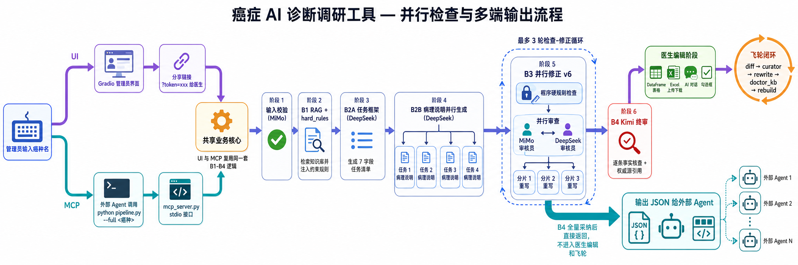

## RAG：作为 Agent 的长期记忆

RAG 不只是问答检索，而是整个 Agent 的长期记忆读取层。

- Base KB 保存基础癌种知识，Doctor KB 保存医生定稿，重建索引保存关键词、癌种结构与检索入口。
- 检索综合语义、任务名、共享关键词、同器官关系与任务类型，不依赖单一向量相似度。
- 医生确认版本拥有最高优先级；同癌种已有完整定稿时，可以直接复用，避免模型重新改写。
- 医生最终修改会被归纳为规则并写回 Doctor KB，随后立即重建索引，让下一次运行使用最新经验。
- RAG 只提供上下文，不能覆盖程序硬规则、字段锁、证据核查或医生最终决定。

## Agent Harness

| 阶段 | 主要职责 | 边界 |
|---|---|---|
| B1 | 癌种解析、RAG 检索、规则注入 | 不生成最终任务 |
| B2A | 生成任务名、任务说明和引用 | 不写长病理说明 |
| B2B | 按任务并行补充病理说明与 AI 方案 | 不增删 B2A 已确认任务 |
| B3 | 程序检查、双模型审核和局部修正 | 只修问题字段，不重写整表 |
| B4 | 联网终审、引用与修改建议 | 不替医生增删任务 |
| Human Gate | 编辑、采纳、忽略和最终确认 | 医生保留最终决定权 |
| Flywheel | 医生 diff → 规则 → Doctor KB → RAG rebuild | 冻结规则由程序保护 |

UI 与 MCP 自动化入口共享同一套生成、审核、RAG、存储和修正核心。UI 中 B4 建议由医生决定是否采纳；无医生实时参与的自动化入口输出结构化结果，但不会伪造医生反馈运行知识飞轮。

## 项目模块

```text
Experience Layer
├── Admin workspace          创建调研、查看历史、触发最终导出
├── Physician workspace      勾选、卡片、对话与表格四种编辑方式
└── MCP entry                为外部 Agent 提供结构化自动化入口

Agent Orchestration
├── Input validator          白名单、癌种规范化与失败短路
├── B1 Context Builder       RAG、Doctor KB、同器官标杆与规则视图
├── B2 Generator             任务框架生成 + 逐任务并行扩写
├── B3 Review Engine         程序检查 + 双审核员 + 分片修正
├── B4 Final Auditor         联网事实核查、引用与修改建议
└── Flywheel                 医生 diff、规则归纳、知识覆盖与索引重建

Shared Infrastructure
├── Token-in-State           前端只携带稳定记录标识
├── Persistent Record        保存任务、审核、submission 与审计轨迹
├── URL Verification         黑名单、真实搜索结果与可访问性标记
└── Excel Contract           七字段结构化交付格式
```

## 交互与通信

- **UI → Orchestrator**：管理员或医生的操作只提交癌种、token、编辑指令和确认状态，不把整份长记录塞进前端 State。
- **Orchestrator → RAG**：B1 传入规范癌种和检索种子，返回预算化上下文、同类任务与适用规则。
- **B2A → B2B**：通过固定任务编号传递任务框架；B2B 每项独立生成，再按编号合并为七字段记录。
- **Auditor → Fixer**：审核模型只返回结构化问题列表，修正模型只处理已定位字段，避免审核与改写互相污染。
- **B4 → Human Gate**：终审输出状态、理由、建议任务说明、建议病理说明与引用；UI 中由医生决定是否采纳。
- **Human Gate → Memory**：医生定稿与 AI 初稿的 diff 进入飞轮，转为规则和 Doctor KB，再重建 RAG 索引。
- **UI / MCP 共核**：两条入口共享同一业务核心；差异只发生在人是否实时在环以及建议是否自动采纳。

更完整的模块、状态、通信与失败回路说明见 [Architecture & Communication](docs/ARCHITECTURE.md)。

## 量化结果

- 内部基准中，最佳模型组合有效任务覆盖率达到 **94.1%（16/17）**，总耗时 **289.6 秒**。
- B2B 并行后等待时间由约 **3–4 分钟降至 1–2 分钟**。
- B3 三分片并行修正由 **180 秒降至 65 秒**，缩短约 **63.9%**。
- 单模型与工作流结果来自不同内部测试表，因此本仓库不将其表述为同一测试集上的 SOTA 对比。

## 产品演示

下面四段动图依次展示从进入系统、编辑任务、查看完整任务表到导出 Excel 的主要使用体验。

<table>
  <tr>
    <td align="center"><strong>01 · 落地页与流程介绍</strong></td>
    <td align="center"><strong>02 · 任务选择与编辑</strong></td>
  </tr>
  <tr>
    <td></td>
    <td>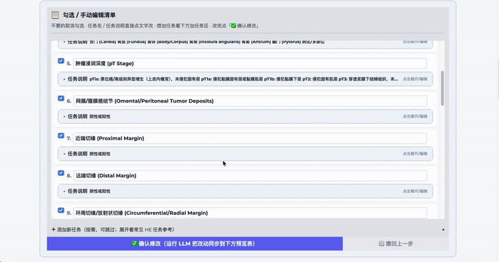</td>
  </tr>
  <tr>
    <td align="center"><strong>03 · 完整任务表与历史结果</strong></td>
    <td align="center"><strong>04 · Excel 导出与继续编辑</strong></td>
  </tr>
  <tr>
    <td></td>
    <td></td>
  </tr>
</table>

> 动图中偶尔出现的 Gradio 分享地址来自历史演示环境，现已失效，不是当前生产入口。

## 截图画廊

### 输入、生成与历史记录

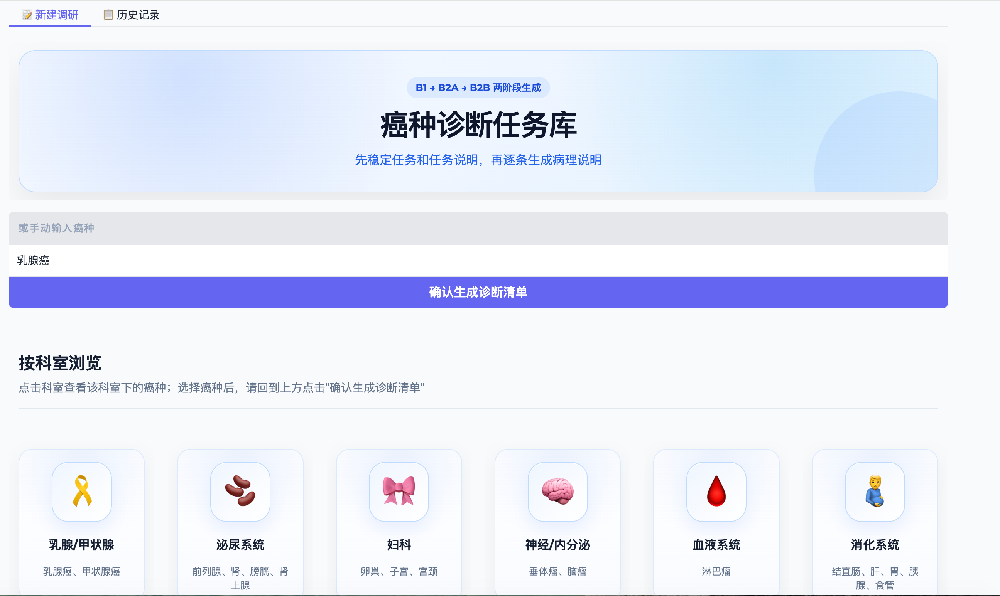

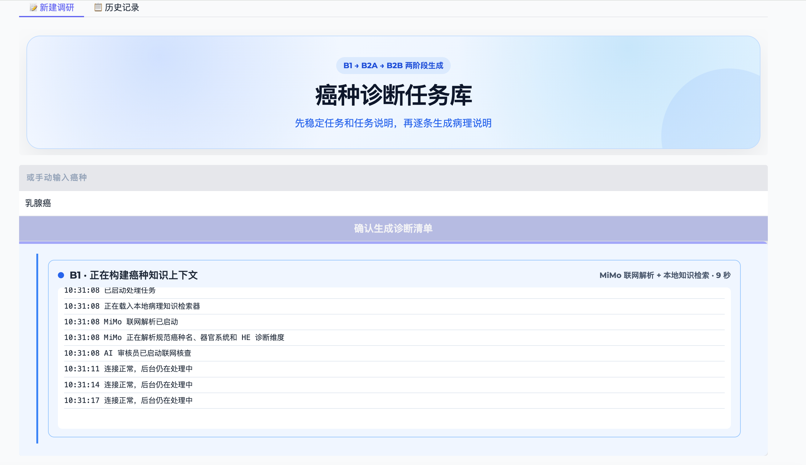

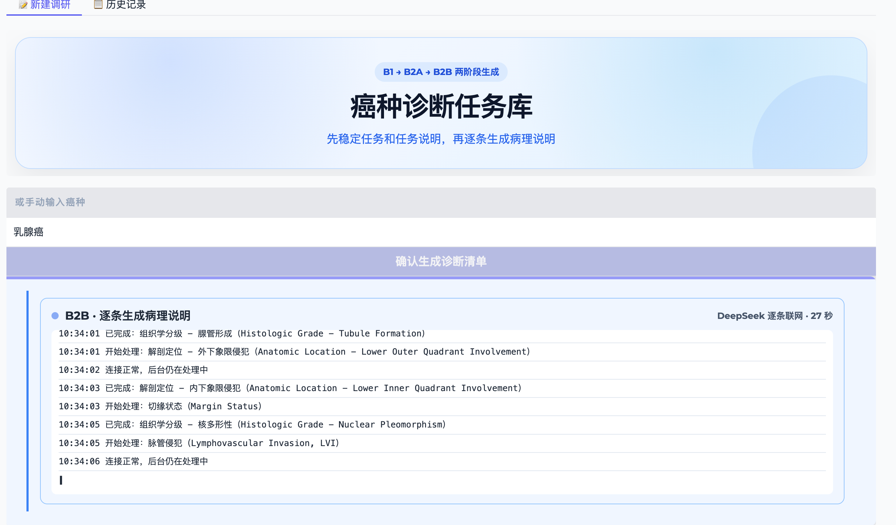

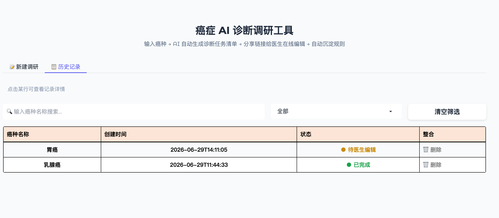

### 医生编辑

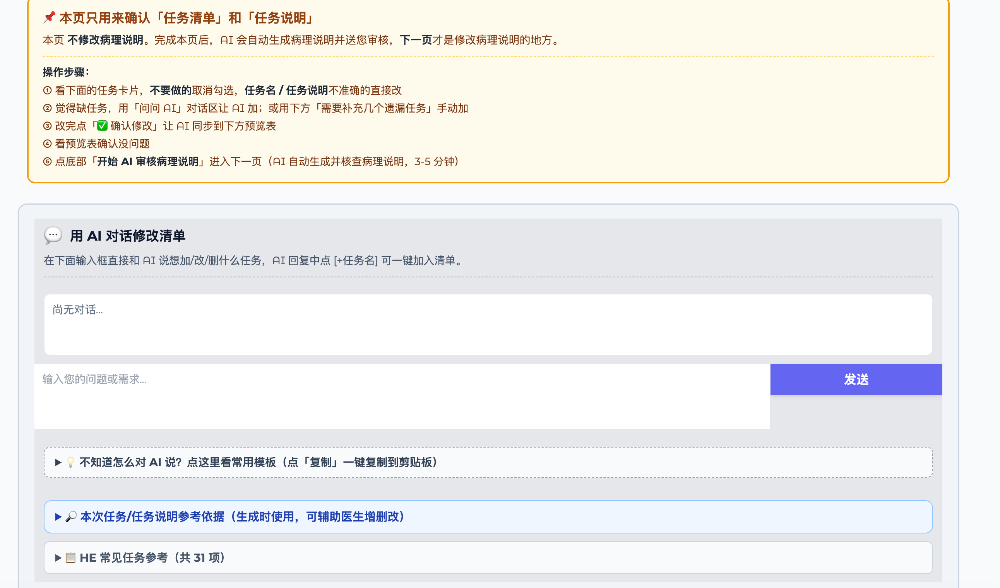

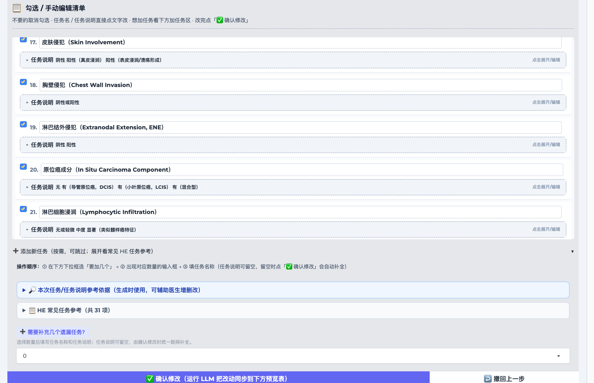

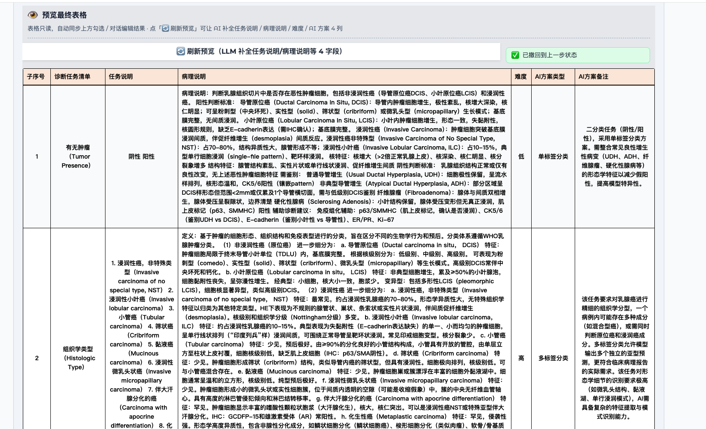

### 多模型审核与修订

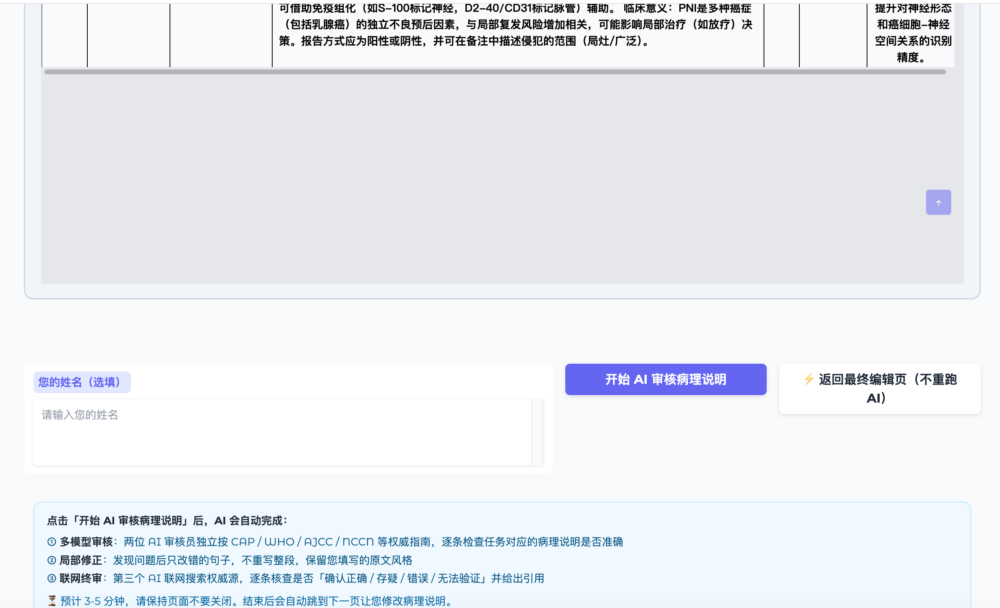

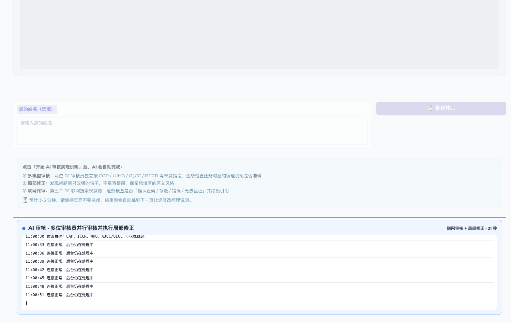

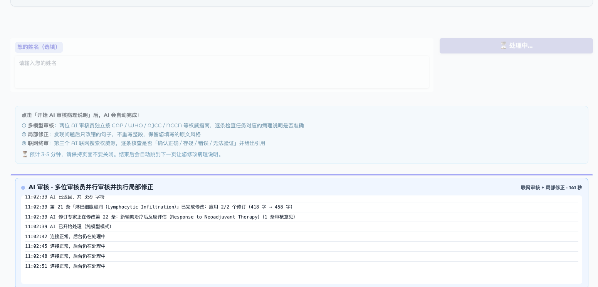

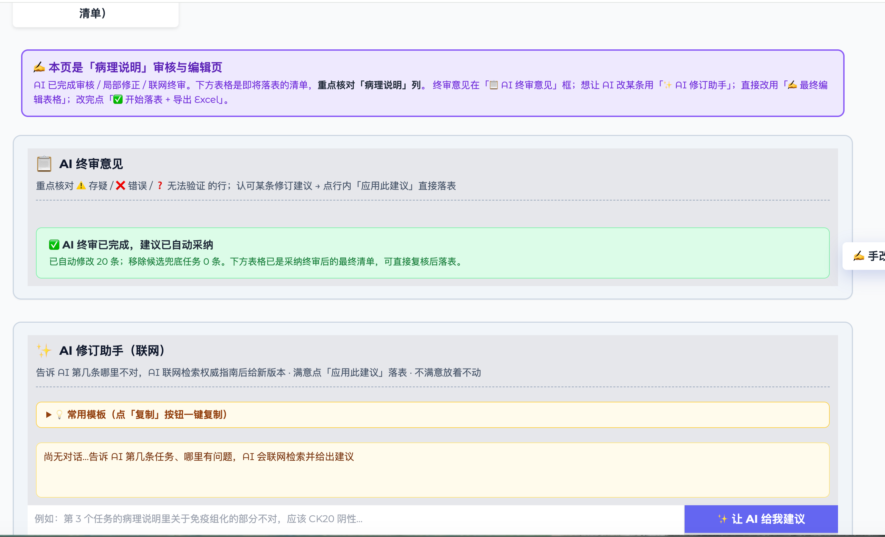

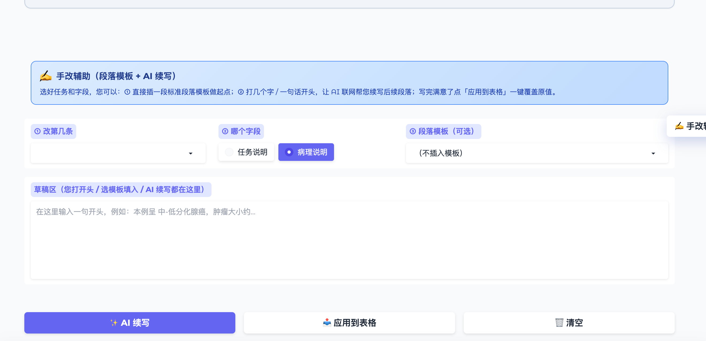

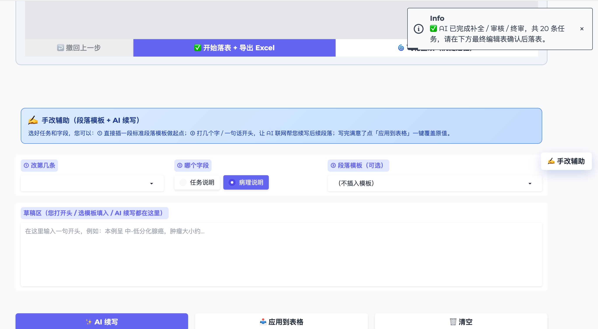

### Excel 结果

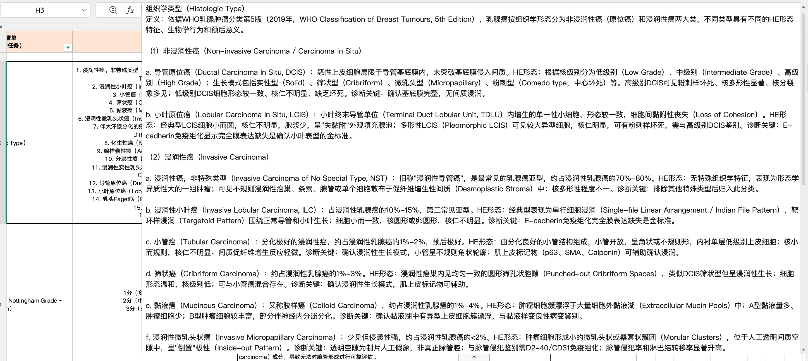

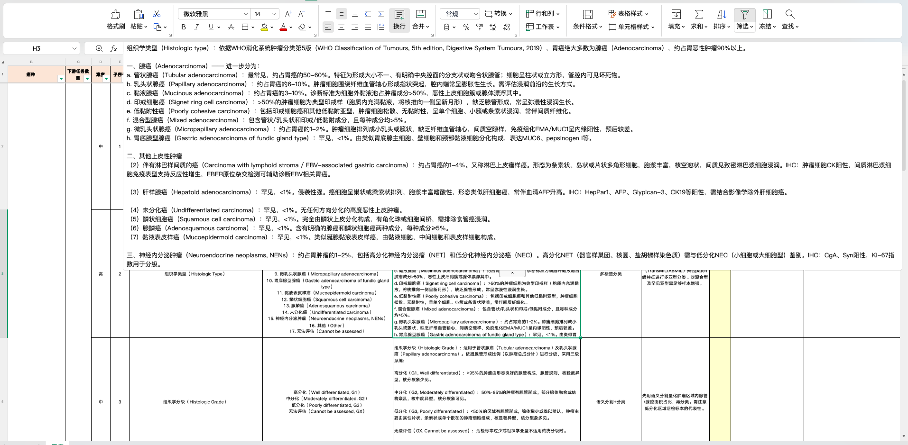

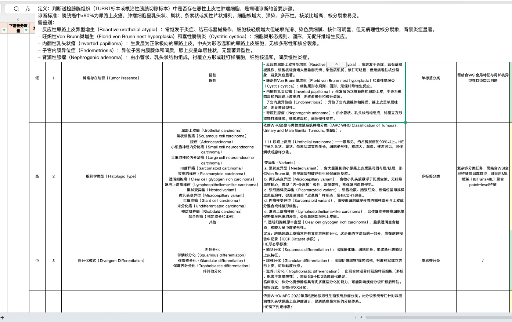

## 不公开内容与商业边界

本系统属于面向商业化落地的单位内部项目。受知识产权、数据合规、医生与患者隐私及商业保密要求限制，本仓库只能公开经过脱敏的流程概览、代表模块、演示动图与非敏感结果，无法公开完整工程实现。

以下内容不在本仓库的公开范围内：

- 生产源码、完整工作流 Graph、真实条件路由、异常恢复逻辑及内部 Harness 设计文档。
- 节点间完整 State Schema、任务合同、输出合同、上下文预算与压缩规则。
- MCP 服务端实现、工具参数 Schema、权限控制、重试策略及调用审计细节。
- 完整 System Prompt、节点 Prompt、审核规则、模型路由策略及内部知识库原文。
- RAG 索引构建、混合检索、排序、规则归纳和医生知识回写的核心实现。
- 医生与患者数据、未脱敏输入输出、人工修改记录、运行日志和内部审计轨迹。
- 私有评测集、完整实验记录、未公开性能指标及生产效果数据。
- API Key、环境变量、服务地址、账户信息、部署架构、服务器配置及安全策略。
- 合作单位信息、商业需求、内部版本路线、交付文档和其他受合同约束的材料。

### 数据、知识与用途声明

本仓库中的截图、动图和示例结果均经过脱敏处理，不包含可识别的患者、医生或合作单位信息。项目中涉及的公开医学知识与术语仅用于非商业的科研交流和工程能力展示，其版权与使用权归相应来源或权利人所有。

公开内容不代表完整生产系统，不用于临床诊断、患者决策或医疗建议，也不构成对第三方数据、知识或素材的再分发授权。如权利人认为展示内容存在问题，可联系仓库维护者进行核验或移除。

动图中出现的历史 Gradio 地址已经失效，本仓库不提供当前生产入口或访问凭据。本仓库只用于展示 Agent Engineering 与医生协作流程，不提供可复现的生产实现，也不构成医疗建议或临床验证结论。

© 2026 WGY. All rights reserved.
